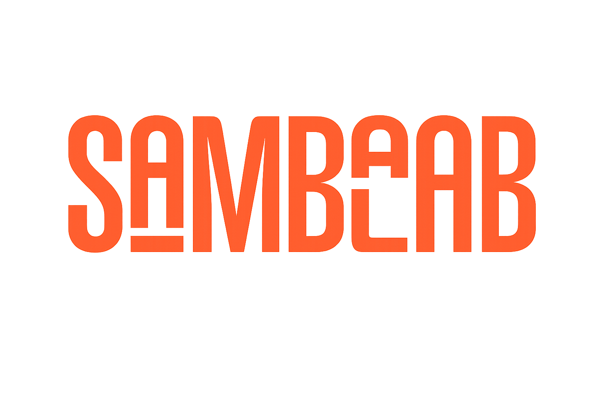

# Sambalab: Laboratorio de Ingeniería Digital y Producto 🚀



Bienvenido al repositorio oficial de **[Sambalab.pro](https://sambalab.pro)**. 

Sambalab no es una agencia de "desarrollo con IA" genérica. Somos un escuadrón de desarrolladores profesionales dedicados a la **ingeniería de producto end-to-end** y a la **co-creación estratégica**. Construimos plataformas robustas que escalan desde el primer día, utilizando las herramientas más avanzadas del mercado (incluyendo IA, Cloud y frameworks modernos) no como slogans, sino como soluciones reales a problemas complejos.

---

## 👥 Quiénes Somos

Sambalab está fundado y dirigido por:

- **Daniel García Rojas (DGRcodex)** — *Ingeniero de Software y Fundador.* Lidera la arquitectura técnica, enfocado en el desarrollo Full Stack, integración de IA y despliegue rápido de MVPs con código sólido.
- **Pedro García Moretti** — *Director de Negocios y Operaciones.* Estrategia comercial y operación. +30 años impulsando crecimiento en servicios y B2B, orquestando la expansión comercial y eficiencia operativa.

Contamos con un equipo extendido de ingenieros y consultores senior para escalar la operación según las necesidades del producto.

---

## 🛠 Tech Stack

Esta plataforma está construida con tecnología de vanguardia para asegurar máximo rendimiento, accesibilidad y escalabilidad:

- **Framework:** [Next.js 15](https://nextjs.org/) (App Router)
- **Lenguaje:** [TypeScript](https://www.typescriptlang.org/)
- **Estilos:** [Tailwind CSS](https://tailwindcss.com/) + CSS puro para patrones generativos (texturas y micro-interacciones).
- **Animaciones:** [Framer Motion](https://www.framer.com/motion/) & [AOS](https://michalsnik.github.io/aos/)
- **CMS Headless:** [Sanity.io](https://www.sanity.io/) (Integrado nativamente en `/studio`)
- **Autenticación:** Firebase Auth en GCP (Próximamente)
- **Analíticas:** Vercel Analytics & Speed Insights
- **Despliegue:** [Vercel](https://vercel.com)

---

## 🏗 Arquitectura del Sitio

El sitio se divide en tres áreas principales:

1. **La Landing (Public Face):** Presenta nuestra metodología (Co-creación y Producto End-to-End), servicios y proyectos destacados. Utiliza diseño "glassmorphism", animaciones suaves y texturas sutiles.
2. **Lab Notes (`/labnotes`):** No es un blog corporativo genérico. Es nuestro "cuaderno de laboratorio". Artículos técnicos densos, reflexiones de ingeniería y el detrás de escena de lo que construimos. Administrado enteramente desde Sanity CMS.
3. **Sambalab Nexus (`/nexus` - en construcción):** Un portal privado autenticado con Firebase donde nuestros clientes y la comunidad pueden acceder a micro-soluciones de código, sandboxes prototipables y herramientas de IA internas.
4. **Sambalab Studio (`/lab` - en construcción):** Nuestro espacio de experimentación creativa interactiva (ej. Poeta: Artista 1).

---

## 📂 Estructura del Código

```text
Sambalabweb/
├── app/
│   ├── (default)/        # Layout público (tiene Navbar y Footer global)
│   │   ├── page.tsx      # Landing page principal
│   │   └── labnotes/     # El blog / Lab Notes (conectado a Sanity)
│   ├── (auth)/           # Pantallas de login/registro
│   ├── studio/           # Sanity Studio embebido (ruta limpia sin Navbar)
│   ├── css/              # Estilos globales y texturas de Tailwind
│   └── layout.tsx        # Root layout (inyecta LayoutShell, tipografías y SEO)
├── components/           # Componentes reutilizables (Hero, Blocks, Features, etc.)
│   ├── ui/               # Componentes core de UI (Header, Footer, Custom Cursor)
│   └── seo/              # JSON-LD Schema y metadatos
├── lib/                  # Utilidades y configuración
│   └── dictionaries.ts   # Sistema de i18n (diccionarios ES/EN)
├── sanity/               # Configuración del Headless CMS
│   ├── schema.ts         # Definición de schemas (Post, Author, Category)
│   └── env.ts            # Variables de entorno para CMS
└── docs/                 # Documentación técnica y planes maestros (ej. plan_maestro_transformacion.md)
```

---

## 🚀 Cómo correr el proyecto localmente

### 1. Clonar e Instalar
```bash
git clone https://github.com/DGRcodex/Sambalab.pro.git
cd Sambalab.pro
npm install
```

### 2. Variables de Entorno
Crea un archivo `.env.local` en la raíz del proyecto. Necesitarás las claves de Sanity (y próximamente Firebase):
```env
NEXT_PUBLIC_SANITY_PROJECT_ID=tu_project_id
NEXT_PUBLIC_SANITY_DATASET=production
NEXT_PUBLIC_SANITY_API_VERSION=2024-01-01
```

### 3. Servidor de Desarrollo
```bash
npm run dev
```
Abre [http://localhost:3000](http://localhost:3000) para ver la página y [http://localhost:3000/studio](http://localhost:3000/studio) para acceder al CMS.

---

## 📝 Gestión de Contenido (Sanity)

Todo el contenido dinámico del "Lab Notes" se maneja sin salir de la app:

1. Ve a `/studio` e inicia sesión con tu cuenta de Google autorizada.
2. Crea "Autores" (Nombre, Foto, Bio).
3. Crea "Posts" (Título, Slug, Imagen, Extracto y Contenido Rich Text).
4. Publica. La página de `/labnotes` hará un revalidate automático (`revalidate: 60`) y mostrará el contenido sin necesidad de reconstruir el proyecto entero.

---

## 🤝 Filosofía

> *"No somos vibe coders. Utilizamos tecnología de vanguardia y metodologías de IA, pero en Sambalab el factor humano y la visión del negocio son los que construyen la arquitectura."*

Si estás interesado en co-crear con nosotros, [conversemos](https://sambalab.pro/#contacto).
